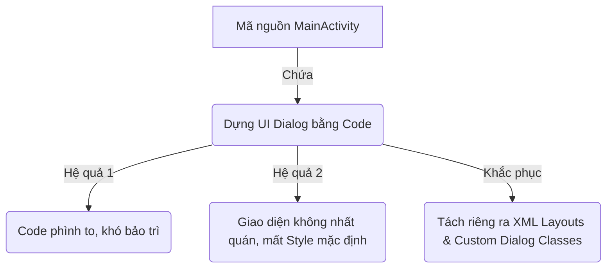

# Phân Tích & Đề Xuất Cải Tiến UI/UX - Dự án CI-Deploy

Tài liệu này đánh giá chi tiết trải nghiệm người dùng (UX) và giao diện (UI) hiện tại của ứng dụng **CI-Deploy** (Android Native Kotlin) và đề xuất các giải pháp nâng cấp toàn diện theo tiêu chuẩn thiết kế Material Design hiện đại.

---

## 📌 1. Tổng Quan & Định Hướng Thiết Kế

Ứng dụng **CI-Deploy** là công cụ hỗ trợ nhà phát triển (Developer Tool) tích hợp nhiều tính năng mạnh mẽ: WebView cổng thông tin CI, Dò tìm máy chủ tự động (Host Discovery), Live Logcat (qua Socket TCP/UDP/WebSocket), API Explorer, Local Webserver và Test TCP.

> [!IMPORTANT]
> Vì đây là công cụ dành cho kỹ thuật và lập trình viên (Developer Tool), giao diện không chỉ cần **đẹp mắt** mà còn phải **rõ ràng, tối ưu hóa không gian hiển thị thông tin kỹ thuật** và **nhất quán**. Tránh cảm giác chắp vá, lỗi thời từ các widget Android mặc định.

### Định Hướng Thẩm Mỹ (Design System)
- **Bảng màu chủ đạo**: Chuyển từ màu xanh mặc định (`#2196F3`) sang tông màu chuyên nghiệp hơn (ví dụ: Deep Slate/Navy Blue kết hợp Accent Color là Teal hoặc Indigo) để tạo cảm giác vững chãi, hiện đại.
- **Dark Mode**: Vì nhà phát triển thường xuyên làm việc trong môi trường tối, toàn bộ ứng dụng cần hỗ trợ đồng bộ giao diện Dark Mode tự động hoặc thủ công.
- **Typography**: Thay thế font hệ thống mặc định bằng các font chữ hiện đại (như *Inter* hoặc *Roboto*) và font monospace chất lượng cao (*JetBrains Mono* hoặc *Fira Code*) cho các phần hiển thị logs, code, console.

---

## 🔍 2. Đánh Giá & Đề Xuất Chi Tiết Từng Thành Phần

### 2.1 Màn Hình Chính & WebView (`MainActivity`)

| Thành phần | Hiện trạng UI/UX | Vấn đề / Hạn chế | Đề xuất cải tiến |
| :--- | :--- | :--- | :--- |
| **WebView** | Hiển thị toàn màn hình dưới Toolbar. | Khi mất kết nối hoặc đang quét Host, màn hình trắng trơn hoặc báo lỗi mặc định của WebView rất xấu. | Thêm trạng thái **Placeholders** sinh động khi đang scan host; hiển thị nút **Retry** được thiết kế đẹp mắt khi tải trang lỗi thay vì dùng Toast báo lỗi kỹ thuật thô sơ. |
| **Toolbar Subtitle** | Hiển thị: `Build: <BuildNo> (rooted)` | Chữ hiển thị dài, thiếu điểm nhấn, các phần tử sát nhau. | Format lại Subtitle gọn gàng, sử dụng icon badge nhỏ màu xanh lá cho trạng thái `Rooted` thay vì mở ngoặc chữ thường. |

---

### 2.2 Thanh Menu Điều Hướng (Navigation Drawer)

> [!WARNING]
> Menu hiện tại đang sử dụng các icon hệ thống kế thừa (`@android:drawable/ic_menu_*`) có độ phân giải thấp, không đồng bộ về phong cách thiết kế và bị mờ trên các màn hình mật độ điểm ảnh cao (High-DPI).

#### Các điểm cần sửa đổi:
1. **Thay thế Icon**: Chuyển toàn bộ icon drawer sang định dạng **Vector Asset (SVG)** của Material Design (ví dụ: `ic_settings`, `ic_history`, `ic_api`, `ic_dns`, `ic_terminal`, `ic_info`).
2. **Drawer Header**: Hiện tại là một vùng màu xanh phẳng. Cần thiết kế lại với hiệu ứng **Gradient**, thêm logo dự án được bo tròn mềm mại và bổ sung thông tin tóm tắt cấu hình máy chủ hiện hành để người dùng dễ quan sát.
3. **Cấu trúc Item**: Thay vì dùng nhiều `LinearLayout` lồng nhau với lề cứng (`layout_marginLeft="32dp"`), sử dụng thư viện chuẩn `com.google.android.material.navigation.NavigationView` cùng tệp menu XML (`menu/drawer_menu.xml`) để tự động hóa việc hiển thị, hỗ trợ highlight trạng thái đang chọn (selected state) và hiệu ứng ripple mượt mà.
4. **Bảng điều khiển Footer**: Phần hiển thị thông tin Web Console ở đáy drawer (`Console: http://127.0.0.1:8085 | PIN: -`) nên được bao bọc trong một **Card** nhỏ có viền bo tròn nhẹ, nền tối tương phản để nổi bật và dễ đọc hơn.

---

### 2.3 Các Hộp Thoại & Màn Hình Cấu Hình (Dialogs & Settings)

> [!CAUTION]
> Hộp thoại cài đặt (Settings) và thông tin phiên bản (Info) hiện tại đang được dựng hoàn toàn **bằng mã nguồn (programmatically)**. Điều này khiến mã nguồn MainActivity cực kỳ dài (gần 1000 dòng), khó bảo trì và giao diện các ô nhập liệu (EditText), nút bấm (Button) bị mất đi kiểu dáng bo tròn đồng bộ của Material Design.



#### Đề xuất cải tiến:
* **Tách File XML Layout**: Tạo riêng các file layout như `dialog_settings.xml`, `dialog_version_info.xml`.
* **Sử dụng TextInputLayout**: Thay thế các `EditText` trần bằng `com.google.android.material.textfield.TextInputLayout` chế độ viền ngoài (outlined box). Hỗ trợ icon đầu/cuối dòng (như icon password ẩn/hiện, icon mạng cho IP).
* **Nâng cấp Tiến trình Tải xuống (Download Update Dialog)**:
  * Khi tải APK cập nhật, thay vì thanh tiến trình phẳng lì đơn điệu, sử dụng `LinearProgressIndicator` của Material kết hợp các góc bo tròn.
  * Hiển thị tốc độ tải xuống thực tế và biểu đồ phần trăm trực quan hơn.

---

### 2.4 Trình Xem Logcat (`LogcatActivity`)

* **Thanh Công Cụ Bộ Lọc (Filter Bar)**:
  * Hiện tại là một hàng ngang gồm `EditText` và 5 nút `ImageButton` nằm sát nhau trên nền xám tối `#1E1E1E`.
  * *Cải tiến*: Gom nhóm các nút chức năng (Auto-Scroll, Clear, Share, Play/Pause, Settings) vào một Toolbar phụ hoặc dùng thanh menu thả xuống (Overflow Menu) để nhường không gian cho ô lọc logs dài hơn.
* **Giao diện Dòng Logs**:
  * Các dòng logs hiển thị chữ monospace đổi màu theo cấp độ (Error - Đỏ, Warning - Cam, Info - Xanh lá, Debug - Xanh dương).
  * *Cải tiến*: Thêm tính năng **Tự động tô sáng từ khóa tìm kiếm (Search Highlighting)** giúp nhà phát triển tìm nhanh dòng lỗi. Thiết kế lại lề (padding) và kích thước dòng logs để hiển thị được nhiều thông tin hơn mà không gây mỏi mắt.
* **Banner Cảnh Báo Quyền (`layoutReadLogsWarning`)**:
  * Hiện trạng: Banner nền nâu sẫm `#4D2E00` chiếm diện tích lớn ở trên cùng khi chưa cấp quyền `READ_LOGS`.
  * *Cải tiến*: Thiết kế lại banner dưới dạng một chiếc **Material Card (Warning Card)** nhỏ gọn, có góc bo tròn, màu sắc dịu hơn (ví dụ: vàng nhạt/vàng cát) kèm nút "Copy Command" rõ ràng.

---

### 2.5 API Explorer & API Detail

* **Badge HTTP Methods**:
  * Hiện tại các method (GET, POST, PATCH, DELETE) được hiển thị dạng chữ phẳng trong hộp màu phẳng (`#64B5F6`, `#4CAF50`...).
  * *Cải tiến*: Đổi sang dạng **Pill Badge** (góc bo tròn 50%), chữ in hoa đậm, màu nền nhạt kết hợp màu chữ đậm (ví dụ: GET có nền xanh nhạt, chữ xanh dương đậm) tương tự như giao diện của Swagger UI hay Postman để tạo cảm giác chuyên nghiệp.
* **Connection Summary**:
  * Thanh hiển thị kết nối máy chủ ở đầu màn hình sử dụng nền xám đơn điệu `#F5F5F5`.
  * *Cải tiến*: Thiết kế nó thành một Card cấu hình nổi bật ở đầu trang, hiển thị rõ ràng Host, Port và trạng thái Authentication.

---

### 2.6 Webserver Settings & Test TCP

* **Webserver Settings (`WebserverSettingsActivity`)**:
  * Toàn bộ màn hình này đang dựng UI bằng code Kotlin.
  * *Cải tiến*: Chuyển đổi hoàn toàn sang XML Layout. Sử dụng `MaterialCardView` để phân vùng các khối: *Trạng thái máy chủ*, *Cấu hình Bảo mật (PIN)*, *Console Logs*, *Hướng dẫn truy cập*.
  * Thay thế các `CheckBox` bằng `MaterialSwitch` để tăng tính hiện đại khi bật/tắt Webserver hoặc PIN Auth.
* **Test TCP (`TestTcpActivity`)**:
  * Bố cục màn hình hiện tại bị nhồi nhét quá nhiều nút và ô nhập liệu trên nền tối `#121212`, thiếu khoảng thở (spacing).
  * *Cải tiến*: Sử dụng **Tabs** (Client Mode / Server Mode) để ẩn bớt các cấu hình không liên quan. Ví dụ: khi chọn tab Client thì ẩn cấu hình Server và nút "Stream Logcat" để giao diện gọn gàng hơn.

---

## 🛠️ 4. Kế Hoạch Triển Khai (Roadmap)

Việc nâng cấp UI/UX sẽ được chia làm 3 giai đoạn để đảm bảo tính ổn định của ứng dụng:

```
[Giai đoạn 1: Refactor UI gốc] ──> [Giai đoạn 2: Chuẩn hóa Styles/Icons] ──> [Giai đoạn 3: Trải nghiệm & Hiệu ứng]
```

### 📅 Giai đoạn 1: Tái cấu trúc Layout và tách mã nguồn (Ưu tiên Cao)
- [ ] Chuyển đổi toàn bộ Dialog được viết bằng code trong [MainActivity.kt](file:///Users/trungtruong/xsofts_prj/web/github/ci-deploy/app/src/main/java/hdisoft/app/cideploy/features/main/presentation/MainActivity.kt) và [WebserverSettingsActivity.kt](file:///Users/trungtruong/xsofts_prj/web/github/ci-deploy/libs/webserver/src/main/java/hdisoft/app/webserver/WebserverSettingsActivity.kt) sang các tệp XML layout chuyên biệt.
- [ ] Sử dụng `com.google.android.material.navigation.NavigationView` cho Menu Drawer.

### 📅 Giai đoạn 2: Nâng cấp linh hồn giao diện (Styles, Colors & Icons)
- [ ] Thay thế các biểu tượng kế thừa bằng hệ thống Vector Icon mới chất lượng cao.
- [ ] Thiết kế các Pill Badges bo tròn cho HTTP Methods trong API Explorer.
- [ ] Định nghĩa lại bảng màu trong `colors.xml` và tích hợp hoàn chỉnh Dark/Light Mode.

### 📅 Giai đoạn 3: Tối ưu hóa vi tương tác (Micro-interactions)
- [ ] Thêm hiệu ứng chuyển cảnh mượt mà giữa các Activity.
- [ ] Thêm tính năng highlight từ khóa tìm kiếm trong Logcat Viewer.
- [ ] Tích hợp tính năng vuốt để làm mới (SwipeRefreshLayout) cho WebView chính và danh sách API Explorer.

---
*Tài liệu phân tích được lập bởi trợ lý Antigravity vào ngày 18/07/2026.*
